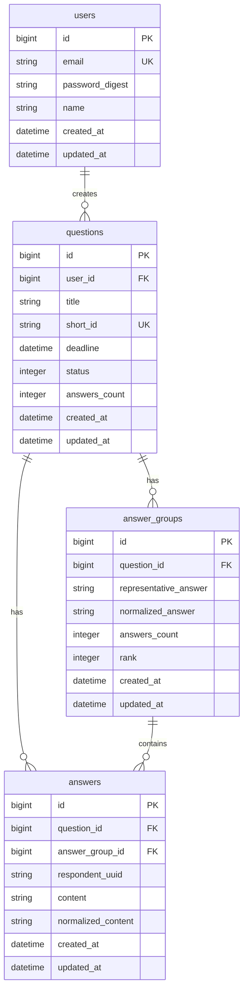

# WE ASKED 100 PEOPLE - データベース設計書

## 1. 概要

このドキュメントでは、WE ASKED 100 PEOPLEアプリケーションのデータベース設計について定義します。
Rails 8の規約に従い、PostgreSQL 15を使用したシンプルで拡張性のある設計を目指します。

## 2. ER図



## 3. テーブル定義

### 3.1 users（質問作成者）

| カラム名 | 型 | NULL | デフォルト | 説明 |
|---------|-----|------|-----------|------|
| id | bigint | NO | AUTO_INCREMENT | 主キー |
| email | string | NO | - | メールアドレス（ユニーク） |
| password_digest | string | NO | - | パスワードハッシュ |
| name | string | YES | NULL | 表示名 |
| created_at | datetime | NO | CURRENT_TIMESTAMP | 作成日時 |
| updated_at | datetime | NO | CURRENT_TIMESTAMP | 更新日時 |

**インデックス:**
- PRIMARY KEY (id)
- UNIQUE INDEX idx_users_email (email)

### 3.2 questions（質問）

| カラム名 | 型 | NULL | デフォルト | 説明 |
|---------|-----|------|-----------|------|
| id | bigint | NO | AUTO_INCREMENT | 主キー |
| user_id | bigint | NO | - | 作成者ID（外部キー） |
| title | string | NO | - | 質問タイトル（100文字以内） |
| short_id | string | NO | - | 短縮ID（ユニーク、8文字） |
| deadline | datetime | NO | - | 回答締切日時 |
| status | integer | NO | 0 | ステータス（0:受付中, 1:締切） |
| answers_count | integer | NO | 0 | 回答数（カウンターキャッシュ） |
| created_at | datetime | NO | CURRENT_TIMESTAMP | 作成日時 |
| updated_at | datetime | NO | CURRENT_TIMESTAMP | 更新日時 |

**インデックス:**
- PRIMARY KEY (id)
- UNIQUE INDEX idx_questions_short_id (short_id)
- INDEX idx_questions_user_id (user_id)
- INDEX idx_questions_status_deadline (status, deadline)

**制約:**
- FOREIGN KEY (user_id) REFERENCES users(id) ON DELETE CASCADE

### 3.3 answers（回答）

| カラム名 | 型 | NULL | デフォルト | 説明 |
|---------|-----|------|-----------|------|
| id | bigint | NO | AUTO_INCREMENT | 主キー |
| question_id | bigint | NO | - | 質問ID（外部キー） |
| answer_group_id | bigint | YES | NULL | グループID（外部キー） |
| respondent_uuid | string | NO | - | 回答者UUID |
| content | string | NO | - | 回答内容（50文字以内） |
| normalized_content | string | NO | - | 正規化済み回答 |
| created_at | datetime | NO | CURRENT_TIMESTAMP | 作成日時 |
| updated_at | datetime | NO | CURRENT_TIMESTAMP | 更新日時 |

**インデックス:**
- PRIMARY KEY (id)
- INDEX idx_answers_question_id (question_id)
- INDEX idx_answers_answer_group_id (answer_group_id)
- UNIQUE INDEX idx_answers_question_respondent (question_id, respondent_uuid)
- INDEX idx_answers_normalized_content (normalized_content)

**制約:**
- FOREIGN KEY (question_id) REFERENCES questions(id) ON DELETE CASCADE
- FOREIGN KEY (answer_group_id) REFERENCES answer_groups(id) ON DELETE SET NULL

### 3.4 answer_groups（回答グループ）

| カラム名 | 型 | NULL | デフォルト | 説明 |
|---------|-----|------|-----------|------|
| id | bigint | NO | AUTO_INCREMENT | 主キー |
| question_id | bigint | NO | - | 質問ID（外部キー） |
| representative_answer | string | NO | - | 代表回答（表示用） |
| normalized_answer | string | NO | - | 正規化済み代表回答 |
| answers_count | integer | NO | 0 | グループ内回答数 |
| rank | integer | YES | NULL | ランキング順位 |
| created_at | datetime | NO | CURRENT_TIMESTAMP | 作成日時 |
| updated_at | datetime | NO | CURRENT_TIMESTAMP | 更新日時 |

**インデックス:**
- PRIMARY KEY (id)
- INDEX idx_answer_groups_question_id (question_id)
- INDEX idx_answer_groups_question_rank (question_id, rank)
- UNIQUE INDEX idx_answer_groups_question_normalized (question_id, normalized_answer)

**制約:**
- FOREIGN KEY (question_id) REFERENCES questions(id) ON DELETE CASCADE

## 4. データベース設計の詳細

### 4.1 正規化レベル
- 第3正規形まで正規化
- パフォーマンスのために一部非正規化（カウンターキャッシュ）

### 4.2 命名規則
- テーブル名: 複数形、スネークケース
- カラム名: スネークケース
- インデックス名: idx_テーブル名_カラム名
- 外部キー: テーブル名_id

### 4.3 文字コード
- UTF-8（utf8mb4）を使用
- 絵文字対応

### 4.4 タイムゾーン
- UTC で保存
- アプリケーション層でJSTに変換

## 5. マイグレーション順序

1. `create_users` - ユーザーテーブル作成
2. `create_questions` - 質問テーブル作成
3. `create_answer_groups` - 回答グループテーブル作成
4. `create_answers` - 回答テーブル作成
5. `add_indexes` - 追加インデックス作成

## 6. パフォーマンス最適化

### 6.1 インデックス戦略
- 外部キーには必ずインデックスを作成
- 検索条件に使用されるカラムにインデックス
- 複合インデックスは使用頻度の高い順に

### 6.2 カウンターキャッシュ
- `questions.answers_count`: 回答数の高速取得
- `answer_groups.answers_count`: グループ内回答数の高速取得

### 6.3 N+1問題対策
- 適切なincludes/joinsの使用
- Bullet gemによる検出

## 7. セキュリティ考慮事項

### 7.1 個人情報保護
- 回答者の個人情報は保存しない
- UUIDのみで識別

### 7.2 データ削除
- CASCADE設定により関連データも適切に削除
- 論理削除は使用しない（GDPR対応）

### 7.3 SQL インジェクション対策
- Active Recordのプレースホルダーを使用
- 生SQLは原則使用しない

## 8. バックアップ戦略

### 8.1 バックアップ頻度
- 日次バックアップ（深夜2時）
- 週次フルバックアップ

### 8.2 保持期間
- 日次バックアップ: 7日間
- 週次バックアップ: 4週間

## 9. 将来の拡張性

### 9.1 想定される追加テーブル
- `categories`: 質問カテゴリー
- `user_profiles`: ユーザー詳細情報
- `answer_reactions`: 回答へのリアクション
- `notifications`: 通知管理

### 9.2 スケーラビリティ
- パーティショニング準備（answers テーブル）
- 読み取り専用レプリカの追加可能
- キャッシュレイヤーの追加（Redis）

## 10. 開発用データ

### 10.1 Seedデータ
```ruby
# db/seeds.rb の構成
- テストユーザー: 3名
- 質問サンプル: 10件
- 回答サンプル: 各質問50-100件
- 多様な回答パターン（類似回答含む）
```

### 10.2 Factory定義
- User Factory
- Question Factory
- Answer Factory
- AnswerGroup Factory

## 11. 監視項目

### 11.1 パフォーマンス監視
- スロークエリログ（1秒以上）
- インデックス使用率
- テーブルサイズ増加率

### 11.2 データ整合性
- 外部キー制約チェック
- カウンターキャッシュの整合性
- 孤立データの検出