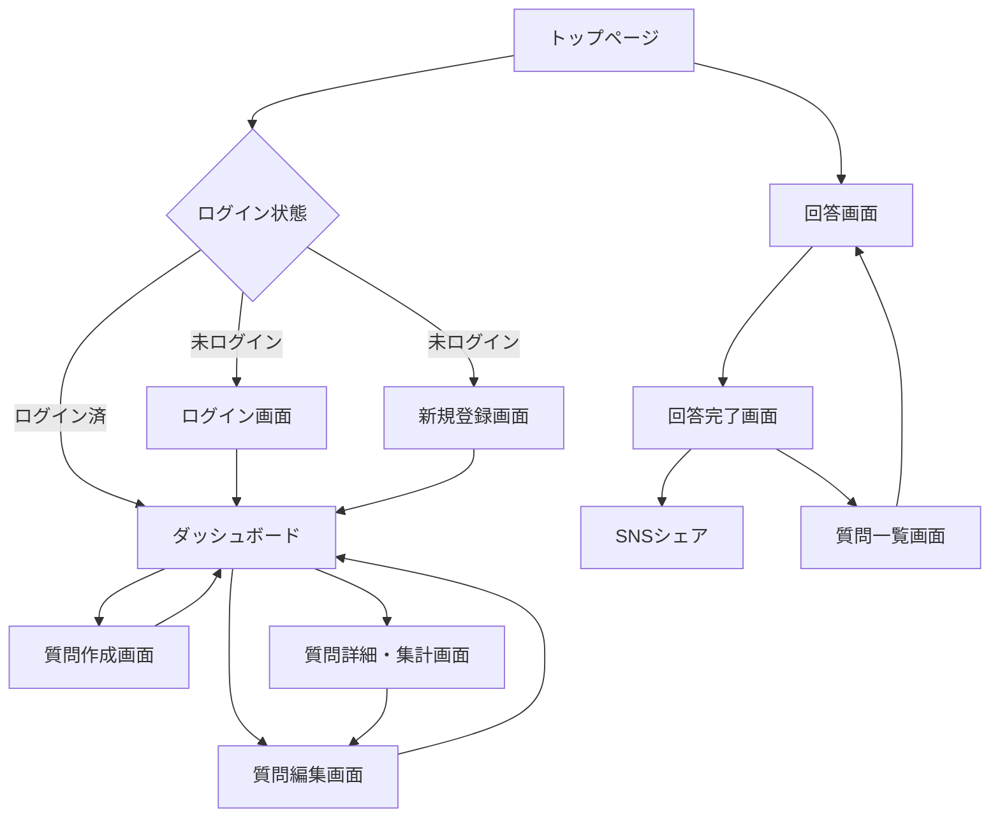

# WE ASKED 100 PEOPLE - UI/UXフロー設計書

## 1. 概要

このドキュメントでは、WE ASKED 100 PEOPLEのユーザーインターフェースと画面遷移を定義します。
シンプルで直感的な操作性を重視し、質問作成者と回答者の両方にとって使いやすいデザインを目指します。

## 2. 画面遷移図

## 3. 画面一覧

### 3.1 共通画面

| 画面名 | URL | 説明 |
|--------|-----|------|
| トップページ | / | サービス説明、ログイン/新規登録へのリンク |
| 404エラー | /404 | ページが見つからない |
| 500エラー | /500 | サーバーエラー |

### 3.2 認証関連画面

| 画面名 | URL | 説明 |
|--------|-----|------|
| ログイン | /login | メール/パスワードでログイン |
| 新規登録 | /signup | アカウント作成 |
| パスワードリセット | /password/reset | パスワード再設定 |

### 3.3 質問作成者向け画面

| 画面名 | URL | 説明 |
|--------|-----|------|
| ダッシュボード | /dashboard | 作成した質問一覧 |
| 質問作成 | /questions/new | 新規質問作成 |
| 質問詳細・集計 | /questions/:id | 集計結果表示 |
| 質問編集 | /questions/:id/edit | 質問の編集 |

### 3.4 回答者向け画面

| 画面名 | URL | 説明 |
|--------|-----|------|
| 回答画面 | /q/:short_id | 質問への回答 |
| 回答完了 | /q/:short_id/complete | 回答送信後の画面 |
| 質問一覧 | /questions | 公開中の質問一覧 |

## 4. 画面詳細設計

### 4.1 トップページ

**構成要素:**
- ヘッダー
  - ロゴ "WE ASKED 100 PEOPLE"
  - ログイン/新規登録ボタン
- ヒーローセクション
  - キャッチコピー「100人に聞きました形式のクイズデータを簡単収集」
  - 「今すぐ始める」ボタン
- 特徴説明
  - 簡単3ステップ（作成→共有→集計）
  - 登録不要で回答可能
  - 自動グルーピング機能
- フッター
  - 利用規約、プライバシーポリシー

### 4.2 ログイン画面

**入力項目:**
- メールアドレス
- パスワード
- 「ログイン」ボタン
- 「パスワードを忘れた方」リンク
- 「新規登録はこちら」リンク

### 4.3 新規登録画面

**入力項目:**
- 名前（オプション）
- メールアドレス
- パスワード
- パスワード確認
- 「登録する」ボタン
- 「既にアカウントをお持ちの方」リンク

### 4.4 ダッシュボード

**構成要素:**
- ヘッダー
  - ユーザー名表示
  - ログアウトボタン
- 「新しい質問を作成」ボタン（目立つ配置）
- 質問カード一覧
  - カード要素:
    - 質問タイトル
    - ステータスバッジ（受付中/締切）
    - 回答数
    - 締切日時
    - 作成日時
    - アクションボタン（詳細/編集/削除）
- ページネーション

### 4.5 質問作成画面

**入力項目:**
- 質問タイトル（100文字以内）
- 締切日時（カレンダー選択、デフォルト2週間後）
- 「作成する」ボタン
- 「キャンセル」ボタン

**バリデーション:**
- タイトル必須
- 締切は現在時刻より後

### 4.6 質問詳細・集計画面

**構成要素:**
- 質問情報セクション
  - タイトル
  - 短縮URL表示
  - URLコピーボタン
  - Xシェアボタン
  - ステータス
  - 締切日時
  - 総回答数
- 集計結果セクション
  - ランキング表（上位10件）
    - 順位
    - 回答内容
    - 票数
    - パーセンテージ
    - グループ編集ボタン
  - コピー用テキストエリア
- アクションボタン
  - 編集
  - 削除（確認モーダル付き）

### 4.7 質問編集画面

**入力項目:**
- 質問タイトル
- 締切日時
- 「更新する」ボタン
- 「キャンセル」ボタン

### 4.8 回答画面（/q/:short_id）

**構成要素:**
- 質問タイトル（大きく表示）
- 回答入力エリア
  - テキストエリア（50文字制限）
  - 文字数カウンター
- 「回答する」ボタン
- 注意書き「回答は1回のみ可能です」

**エラー処理:**
- 既に回答済みの場合のメッセージ
- 締切済みの場合のメッセージ

### 4.9 回答完了画面

**構成要素:**
- 完了メッセージ「回答ありがとうございました！」
- Xシェアセクション
  - 「回答したことをXでシェア」ボタン（大きく目立つ）
  - シェア文言プレビュー
- 「他の質問も見てみる」ボタン
- 「トップに戻る」リンク

### 4.10 質問一覧画面（公開版）

**構成要素:**
- タイトル「みんなの質問」
- フィルター
  - 受付中のみ表示
- 質問カード一覧
  - 質問タイトル
  - 締切まで残り時間
  - 現在の回答数
  - 「回答する」ボタン
- ページネーション

## 5. UIコンポーネント設計

### 5.1 共通コンポーネント

**ヘッダー:**
- ロゴ（クリックでトップへ）
- ナビゲーションメニュー
- ユーザーメニュー（ログイン時）

**フッター:**
- コピーライト
- リンク集

**カード:**
- 影付きの角丸デザイン
- ホバーエフェクト

**ボタン:**
- プライマリ（青）: 主要アクション
- セカンダリ（グレー）: 補助アクション
- デンジャー（赤）: 削除など
- サクセス（緑）: 完了など

**バッジ:**
- 受付中（緑）
- 締切（グレー）

**モーダル:**
- 削除確認
- エラー表示

### 5.2 フォーム要素

**入力フィールド:**
- ラベル付き
- プレースホルダー
- エラーメッセージ表示エリア

**テキストエリア:**
- 文字数カウンター
- リアルタイムバリデーション

## 6. レスポンシブ対応（将来実装）

### 6.1 ブレークポイント
- デスクトップ: 1024px以上
- タブレット: 768px - 1023px
- スマートフォン: 767px以下

### 6.2 モバイル最適化
- タッチフレンドリーなボタンサイズ
- スワイプ操作対応
- 縦向き/横向き対応

## 7. アクセシビリティ

### 7.1 基本方針
- WAI-ARIA準拠
- キーボード操作対応
- スクリーンリーダー対応

### 7.2 実装項目
- 適切なalt属性
- フォームラベルの関連付け
- フォーカス管理
- コントラスト比確保

## 8. パフォーマンス最適化

### 8.1 画像最適化
- 適切なフォーマット選択
- 遅延読み込み
- レスポンシブ画像

### 8.2 CSS/JS最適化
- ミニファイ
- バンドル最適化
- クリティカルCSS

## 9. エラー処理とフィードバック

### 9.1 エラーメッセージ
- 明確で具体的な内容
- 解決方法の提示
- 適切なタイミングで表示

### 9.2 成功メッセージ
- フラッシュメッセージ
- トースト通知
- アニメーション効果

## 10. 国際化対応準備

### 10.1 テキスト管理
- i18nファイルでの一元管理
- 日付フォーマットの統一
- 数値フォーマットの統一

### 10.2 レイアウト考慮
- テキスト長の変動に対応
- RTL言語への対応準備

## 11. デザインシステム

### 11.1 カラーパレット
- プライマリ: #007bff
- セカンダリ: #6c757d
- サクセス: #28a745
- デンジャー: #dc3545
- ワーニング: #ffc107
- インフォ: #17a2b8

### 11.2 タイポグラフィ
- フォント: システムフォント優先
- 見出し: 1.5rem - 2.5rem
- 本文: 1rem
- 補助テキスト: 0.875rem

### 11.3 スペーシング
- 基本単位: 8px
- パディング: 8px, 16px, 24px, 32px
- マージン: 8px, 16px, 24px, 32px

## 12. 実装優先順位

### Phase 1（MVP）
1. 基本的な画面レイアウト
2. 必須機能の実装
3. デスクトップ対応のみ

### Phase 2
1. UIの洗練
2. アニメーション追加
3. モバイル対応

### Phase 3
1. ダークモード
2. アクセシビリティ強化
3. パフォーマンス最適化